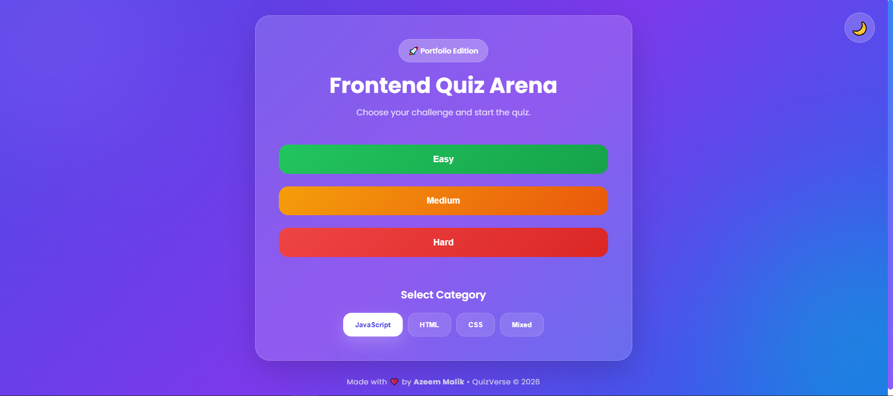
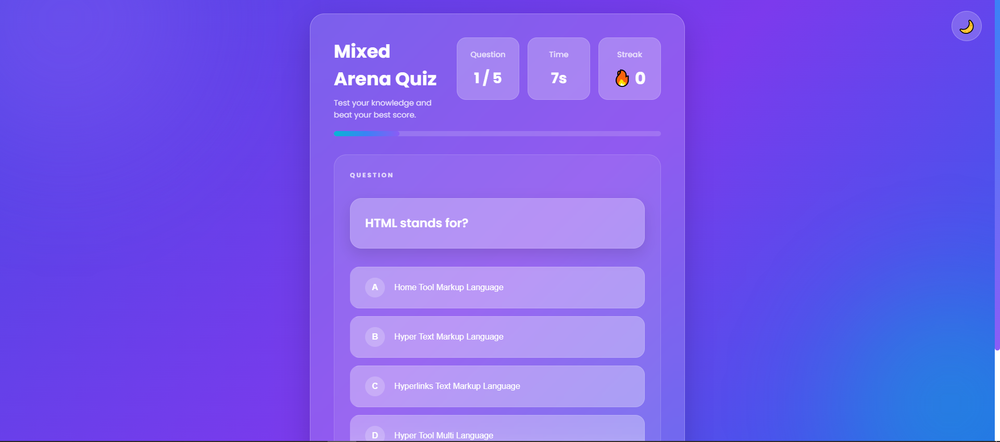
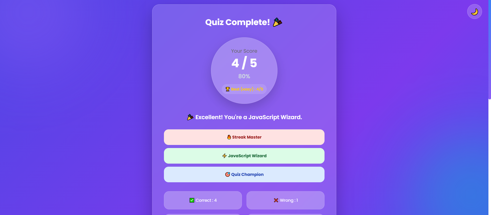
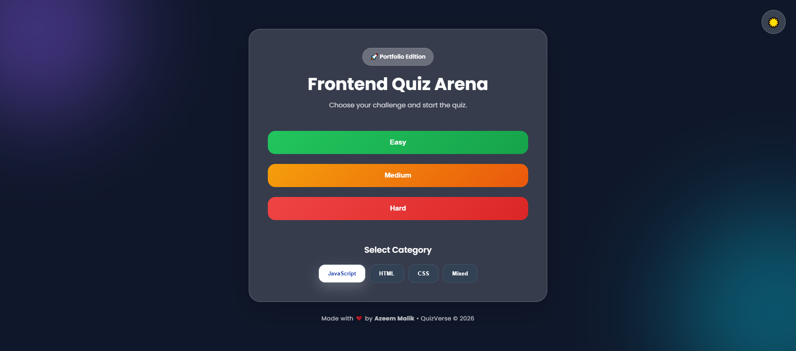

# 🧠 QuizVerse

A modern and interactive **Frontend Quiz Application** built using **HTML, CSS, and JavaScript**. Test your knowledge in JavaScript, HTML, and CSS through a beautiful UI with animations, multiple difficulty levels, dark mode, and detailed quiz statistics.

---

## 🚀 Features

* 🎯 Three Quiz Categories

  * JavaScript
  * HTML
  * CSS
  * Mixed Mode

* 📊 Three Difficulty Levels

  * Easy
  * Medium
  * Hard

* 🌙 Dark / Light Theme

* ⏳ Countdown Timer

* 🔥 Streak Counter

* 📈 Animated Progress Bar

* 🏆 Best Score (Saved using Local Storage)

* 🎉 Confetti Celebration for Perfect Score

* 📋 Answer Review after Quiz

* 📱 Fully Responsive Design

* ✨ Smooth Animations & Glassmorphism UI

* 🔊 Sound Effects

---

## 🛠️ Built With

* HTML5
* CSS3
* JavaScript (ES6)
* Local Storage API
* Canvas Confetti

---

## 📸 Screenshots

### 🏠 Home Screen



### ❓ Quiz Screen



### 🎉 Result Screen



### 🌙 Dark Mode



---

# 🧠 QuizVerse

🔗 **Live Demo:** https://quizeverse.netlify.app/

A modern Frontend Quiz Application built with HTML, CSS and JavaScript.

---

## 📂 Project Structure

```text
QuizVerse/
│
├── index.html
├── style.css
├── script.js
├── assets/
│   └── brain.png
└── README.md
```

---

## 🎮 How to Play

1. Choose a difficulty level.
2. Select your preferred category.
3. Answer each question before the timer ends.
4. View your score, achievements, and detailed answer review.
5. Try again and beat your best score.

---

## 💾 Local Storage

QuizVerse stores:

* 🌙 Selected Theme
* 🏆 Best Score (Category & Difficulty Wise)

---

## 📱 Responsive

The application is optimized for:

* Desktop
* Tablet
* Mobile

---

## 🌟 Future Improvements

* Keyboard Shortcuts
* More Quiz Categories
* Question Database/API
* User Authentication
* Leaderboard
* Multiplayer Mode

---

## 👨‍💻 Author

**Azeem Malik**

Built with ❤️ using HTML, CSS & JavaScript.

---

## ⭐ Support

If you like this project, don't forget to give it a ⭐ on GitHub.
